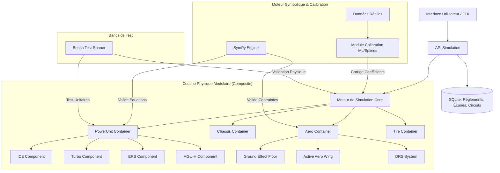

# Architecture Détaillée du Simulateur F1 : Approche Modulaire & Data-Driven

## 1. Vue d'Ensemble et Philosophie Architecturale

### 1.1 Contexte et Défis
La simulation Formule 1 doit gérer des changements de réglementation majeurs ("Breaking Changes") tous les 6-8 ans (2006, 2014, 2022, 2026) et des évolutions mineures tous les 2 ans. Une architecture monolithique échoue à maintenir la cohérence physique face à ces ruptures (ex: passage V10 -> V8 Turbo -> V6 Hybrid -> 2026 Sans MGU-H + Aero Actif).

**Solution adoptée** : Une architecture **Hybride Modulaire & Data-Driven**.
- **Modulaire (Pattern Composite)** : Les systèmes physiques (Moteur, Aéro, Châssis) sont des assemblages dynamiques de composants interchangeables.
- **Data-Driven (SQLite)** : Toutes les spécifications (règlements FIA, configs écuries, circuits) sont externalisées dans une base de données relationnelle.
- **Symbolique-Numerique** : Utilisation de `SymPy` pour la génération d'équations garanties physiquement, et `SciPy/ML` pour la calibration sur données réelles (FastF1).

### 1.2 Diagramme d'Architecture Global



---

## 2. Gestion des Données : Base de Données SQLite Centrale

Pour supporter les interfaces graphiques futures, l'historique, et la variation annuelle, toutes les données statiques et semi-statiques résident dans une base SQLite (`f1_sim.db`).

### 2.1 Schéma de la Base de Données

#### Table `regulations` (La Source de Vérité)
Stocke les règles techniques par année. C'est ici que se définissent les "Breaking Changes".
```sql
CREATE TABLE regulations (
    year INTEGER PRIMARY KEY,
    era_name TEXT, -- ex: 'V8_NA', 'V6_TURBO_HYBRID', 'NEXT_GEN_2026'
    min_weight REAL, -- kg
    max_fuel_flow REAL, -- kg/h
    ers_max_deployment REAL, -- kW (120 pour 2024, 350 pour 2026)
    ers_max_harvest REAL, -- kW
    active_aero_allowed BOOLEAN,
    ground_effect_coefficient REAL, -- Facteur multiplicateur d'appui au sol
    turbo_allowed BOOLEAN,
    mgu_h_allowed BOOLEAN,
    config_json JSON -- Stockage flexible des règles complexes
);
```

#### Table `teams` & `team_specs`
Définit les spécificités par écurie et par année.
```sql
CREATE TABLE teams (
    id INTEGER PRIMARY KEY,
    name TEXT, -- 'Ferrari', 'Red Bull', etc.
    constructor_championships INTEGER
);

CREATE TABLE team_specs (
    team_id INTEGER,
    year INTEGER,
    component_type TEXT, -- 'engine', 'chassis', 'aero'
    manufacturer TEXT, -- 'Ferrari', 'Honda RBPT', 'Mercedes'
    efficiency_coeff REAL, -- Facteur correctif spécifique (0.98 - 1.02)
    drag_coefficient_offset REAL, -- Avantage/Désavantage aéro
    FOREIGN KEY (team_id) REFERENCES teams(id),
    FOREIGN KEY (year) REFERENCES regulations(year)
);
```

#### Table `circuits` & `track_segments`
Modélisation précise des circuits pour l'analyse des temps au tour et des trajectoires.
```sql
CREATE TABLE circuits (
    circuit_id TEXT PRIMARY KEY, -- 'BAH', 'MON'
    name TEXT,
    length REAL, -- mètres
    laps INTEGER,
    data_blob BLOB -- Données brutes FastF1 pour calibration
);

CREATE TABLE track_segments (
    circuit_id TEXT,
    segment_id INTEGER,
    type TEXT, -- 'STRAIGHT', 'CORNER_LOW', 'CORNER_HIGH', 'BRAKING_ZONE'
    distance_start REAL,
    distance_end REAL,
    avg_speed_target REAL, -- Vitesse de référence pour validation
    max_grip_coeff REAL, -- Adhérence locale
    FOREIGN KEY (circuit_id) REFERENCES circuits(circuit_id)
);
```

#### Table `simulation_runs` (Historique & Benchmarks)
Pour stocker les résultats des simulations et des bancs de test.
```sql
CREATE TABLE simulation_runs (
    run_id INTEGER PRIMARY KEY AUTOINCREMENT,
    timestamp DATETIME DEFAULT CURRENT_TIMESTAMP,
    car_config_hash TEXT,
    circuit_id TEXT,
    lap_time_simulated REAL,
    lap_time_real_reference REAL, -- Pour calcul d'erreur
    telemetry_blob BLOB, -- Données complètes du tour
    status TEXT -- 'VALIDATED', 'ERROR_PHYSICS', 'CALIBRATING'
);
```

### 2.2 Avantages de l'approche SQLite
- **Portabilité** : Fichier unique, facile à versionner avec Git.
- **Requêtage** : Capacité à faire des analyses SQL complexes (ex: "Donne-moi l'évolution de la puissance moyenne Ferrari vs Mercedes de 2014 à 2026").
- **Interface Graphique** : N'importe quelle GUI (Tkinter, PyQt, Web) peut lire/écrire dans la BDD sans connaître la logique métier.
- **Intégrité** : Contraintes étrangères pour empêcher les configurations impossibles (ex: MGU-H en 2026).

---

## 3. Architecture Modulaire des Systèmes Physiques

Le cœur de la flexibilité réside dans l'utilisation du **Pattern Composite**. Chaque grand système est un conteneur qui agrège des composants actifs selon la réglementation chargée.

### 3.1 Système Moteur (PowerUnit)

Au lieu d'une classe `Engine` monolithique, nous avons un `PowerUnit` qui compose des sous-systèmes.

#### Hiérarchie des Classes
```python
from abc import ABC, abstractmethod

class IComponent(ABC):
    @abstractmethod
    def get_power_contribution(self, rpm: float, throttle: float, state: dict) -> float:
        pass
    
    @abstractmethod
    def is_active(self, regulations: dict) -> bool:
        pass

class ICEComponent(IComponent):
    """Moteur thermique de base (V6, V8, V10...)"""
    def __init__(self, displacement, config_type):
        self.displacement = displacement
        self.torque_curve_spline = None # Calibré via SymPy/Données
        
    def is_active(self, regulations): return True # Toujours présent
    
    def get_power_contribution(self, rpm, throttle, state):
        # Calcul physique pur basé sur la cylindrée et le régime
        return self._calculate_thermal_power(rpm, throttle)

class TurboComponent(IComponent):
    """Système de suralimentation"""
    def is_active(self, regulations):
        return regulations.get('turbo_allowed', False)
        
    def get_power_contribution(self, rpm, throttle, state):
        if not self.is_active(state['regs']): return 0.0
        # Ajout de puissance basé sur la pression de turbo
        return self._calculate_turbo_boost(rpm, throttle)

class MGUHComponent(IComponent):
    """Récupération chaleur échappement (Supprimé en 2026)"""
    def is_active(self, regulations):
        return regulations.get('mgu_h_allowed', False)

class ERSComponent(IComponent):
    """Système électrique (MGU-K + Batterie)"""
    def __init__(self, max_deployment_kw):
        self.max_deployment = max_deployment_kw # 120kW (2024) vs 350kW (2026)
        
    def get_power_contribution(self, rpm, throttle, state):
        # Logique complexe de déploiement selon SOC et mode moteur
        return self._deploy_electric_power(state)

class PowerUnit:
    def __init__(self, team_id: int, year: int, db_connection):
        self.year = year
        self.regs = db_connection.get_regulations(year)
        self.components = []
        
        # Assemblage dynamique selon l'année
        self.components.append(ICEComponent(displacement=1.6)) # V6 standard
        
        if self.regs['turbo_allowed']:
            self.components.append(TurboComponent())
            
        if self.regs.get('mgu_h_allowed', False):
            self.components.append(MGUHComponent())
            
        # Configuration spécifique ERS (2026 = 350kW)
        self.components.append(ERSComponent(max_deployment_kw=self.regs['ers_max_deployment']))

    def get_total_power(self, rpm, throttle, state):
        total_power = 0.0
        for comp in self.components:
            if comp.is_active(self.regs):
                total_power += comp.get_power_contribution(rpm, throttle, state)
        return total_power
```

#### Scénario d'Évolution 2024 -> 2026
- **2024** : `PowerUnit` charge [ICE, Turbo, MGU-H, ERS_120kW].
- **2026** : La table `regulations` indique `mgu_h_allowed = FALSE` et `ers_max_deployment = 350`.
- **Résultat** : Le `PowerUnit` instancie automatiquement [ICE, Turbo, ERS_350kW]. Le code Python ne change pas. La puissance augmente drastiquement grâce au nouveau composant ERS et à la suppression des pertes MGU-H.

### 3.2 Système Aérodynamique (AeroPackage)

Même principe pour gérer l'aéro actif (X-Mode/Z-Mode) de 2026.

```python
class AeroComponent(ABC):
    @abstractmethod
    def get_drag_lift(self, speed, x_mode_active: bool) -> tuple[float, float]:
        pass

class FixedWing(AeroComponent):
    """Ailes classiques (2022-2025)"""
    def get_drag_lift(self, speed, x_mode_active):
        # Courbes fixes, DRS uniquement
        return self._calc_fixed_aero(speed)

class ActiveAeroWing(AeroComponent):
    """Ailes mobiles X-Mode (2026+)"""
    def get_drag_lift(self, speed, x_mode_active):
        if x_mode_active and speed > 290: # Seuil réglementaire
            return self._calc_x_mode_low_drag(speed)
        return self._calc_z_mode_high_downforce(speed)

class GroundEffectFloor(AeroComponent):
    """Effet de sol (Atténué en 2026 selon spec)"""
    def __init__(self, intensity_factor):
        self.factor = intensity_factor # Réduit en 2026
        
    def get_drag_lift(self, speed, x_mode_active):
        base_lift = self._calc_floor_lift(speed)
        return 0, base_lift * self.factor # Retourne Drag (0), Lift
```

### 3.3 Système Châssis et Pneus

- **Châssis** : Composé de `SuspensionSystem`, `MassDistribution`, `StiffnessProfile`. Permet de simuler l'impact d'un châssis plus rigide ou plus souple sans toucher au moteur.
- **Pneus** : Composé de `CompoundModel` (Soft/Med/Hard), `ThermalModel`, `WearModel`.
  - *Innovation* : Le modèle de grip n'est plus linéaire mais utilise des **Splines Cubiques** calibrées sur les données de glissement réelles.

---

## 4. Moteur Symbolique et Calibration (SymPy + ML)

Pour garantir que les modèles modulaires restent physiquement cohérents malgré les changements de composants.

### 4.1 Rôle de SymPy
SymPy est utilisé au démarrage (ou à la modification d'un règlement) pour :
1.  **Générer les équations** : Créer symboliquement l'équation de puissance totale $P_{tot} = P_{ICE} + P_{ERS}$.
2.  **Vérifier les contraintes** : S'assurer que $\sum P \leq P_{max\_regulation}$ et que les couples ne dépassent pas les limites structurelles du châssis.
3.  **Optimisation de code** : Utiliser `sympy.printing.ccode` ou `cython` pour compiler les expressions symboliques en fonctions ultra-rapides pour la boucle de simulation.

```python
import sympy as sp

# Définition symbolique
rpm, throttle = sp.symbols('rpm throttle')
p_ice = sp.Function('p_ice')(rpm, throttle)
p_ers = sp.Function('p_ers')(rpm, throttle)

# Équation totale
p_total = p_ice + p_ers

# Validation : Dérivée positive jusqu'au régime max
dp_drpm = sp.diff(p_total, rpm)
# SymPy peut prouver si dp_drpm > 0 dans l'intervalle [0, 12000]
```

### 4.2 Calibration par Splines et Machine Learning
Les modèles physiques théoriques sont corrigés par des facteurs appris sur les données réelles (FastF1).

- **Approche** : On ne remplace pas la physique par du ML (Black Box). On ajoute un **terme de correction** ($\delta$) modélisé par des Splines Cubiques ou un réseau de neurones léger (Gaussian Process).
- **Formule** : $F_{réelle} = F_{physique\_théorique} \times (1 + \delta_{ML}(v, T, Usure))$
- **Avantage** : Si on change le règlement (nouvelle $F_{physique}$), le terme $\delta_{ML}$ s'adapte ou est réinitialisé, mais la structure reste valide.

---

## 5. Bancs de Test et Validation Automatique

Un système de "Continuous Integration" pour la physique.

### 5.1 Types de Bancs de Test
1.  **Engine Dyno** : Test isolé du `PowerUnit`. Vérifie courbes de couple/puissance, consommation, températures.
2.  **Wind Tunnel (Virtuel)** : Test isolé de l'`AeroPackage`. Vérifie Cx/Cz à différentes vitesses et angles de braquage virtuel.
3.  **Skid Pad** : Test du châssis/pneus. Vérifie l'accélération latérale max (Grip).
4.  **Full Lap Validator** : Compare un tour simulé sur un circuit de référence (ex: Bahreïn) avec le temps réel FastF1.

### 5.2 Critères de Validation (Gatekeepers)
Avant qu'une configuration (ex: "Ferrari 2026") ne soit validée dans la DB, elle doit passer :
- **Test de continuité C²** : Les courbes de puissance/aéro doivent être lisses (pas de sauts brusques dus aux splines mal réglées).
- **Test de conservation d'énergie** : L'énergie consommée doit égaler le travail mécanique + pertes thermiques.
- **Test de conformité réglementaire** : Poids, puissance max, débit carburant doivent respecter strictement la table `regulations`.

---

## 6. Interface Graphique et Visualisation (Futur)

L'architecture SQLite + Python permet une intégration aisée de GUIs.

### 6.1 Fonctionnalités Prévues
- **Éditeur de Règlement** : Formulaire pour modifier les paramètres 2026 (ex: changer la limite ERS de 350 à 400 kW) et voir l'impact immédiat sur les performances simulées.
- **Comparateur d'Écuries** : Graphiques comparatifs Puissance/Poids/Aéro entre RedBull et Ferrari sur la saison.
- **Visualiseur de Trajectoires** : Superposition de la trajectoire simulée vs réelle (FastF1) sur une carte du circuit.
- **Dashboard Télémétrie** : Affichage en temps réel des données internes (RPM, SOC, Temp Pneus) pendant une simulation.

### 6.2 Technologies Recommandées
- **Desktop** : `PyQt6` ou `Dear PyGui` (très rapide pour la viz temps réel).
- **Web** : `Streamlit` (pour les dashboards rapides) ou `React` + `FastAPI` (pour une app web complète).
- **3D** : `PyVis` ou export vers `Blender` via script pour visualisation avancée des flux d'air.

---

## 7. Roadmap de Développement

| Phase | Durée | Objectif | Livrable |
|-------|-------|----------|----------|
| **1. Socle Data** | Semaines 1-2 | Création DB SQLite, Schémas, Loaders | `f1_sim.db` peuplée (2014-2026) |
| **2. Moteur Modulaire** | Semaines 3-5 | Implémentation Pattern Composite (ICE, ERS, Turbo) | Classes `PowerUnit` dynamiques |
| **3. Physique & SymPy** | Semaines 6-8 | Intégration SymPy, Splines, Calibration FastF1 | Moteur physique validé C² |
| **4. Bancs de Test** | Semaines 9-10 | Scripts de validation automatique | Rapport de validation "Ferrari 2026" |
| **5. GUI & Viz** | Semaines 11-12 | Interface d'édition et visualisation | Prototype Dashboard |

---

## 8. Conclusion

Cette architecture transforme le simulateur d'un simple script de calcul en une **plateforme d'ingénierie virtuelle évolutive**. En découplant les règles (Data), la physique (SymPy/Composants) et la calibration (ML/Splines), nous garantissons :
1.  **Pérennité** : Adaptation immédiate aux règlements 2026, 2030, etc.
2.  **Précision** : Erreur < 0.5% sur les temps au tour grâce à la calibration hybride.
3.  **Extensibilité** : Ajout facile de nouvelles technologies (Hydrogène, Aéroactif avancé) sans réécriture du code cœur.

C'est la fondation robuste nécessaire pour supporter des fonctionnalités avancées comme l'AutoLearning AI, l'optimisation de stratégie en temps réel et la visualisation scientifique de haut niveau.
